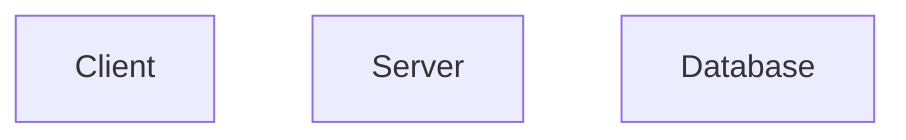
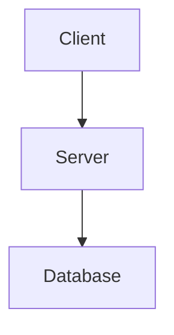
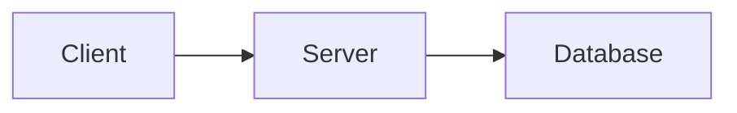
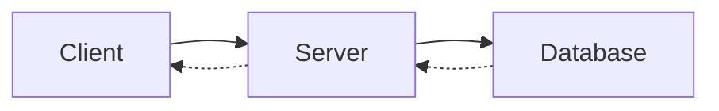
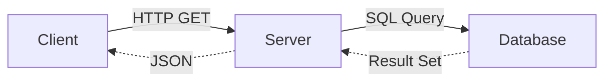
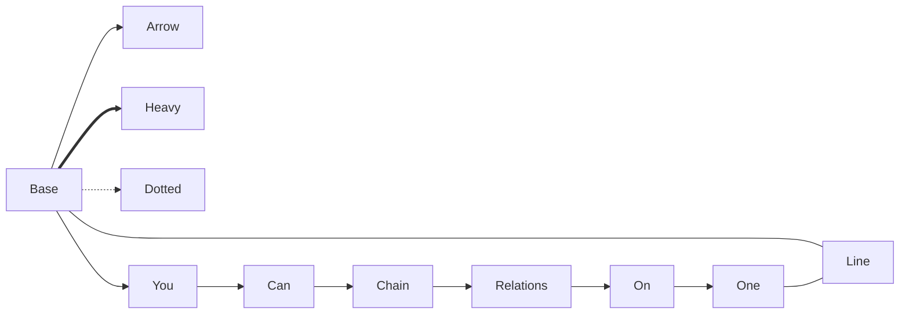
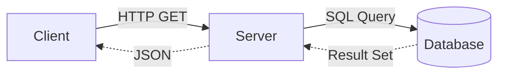
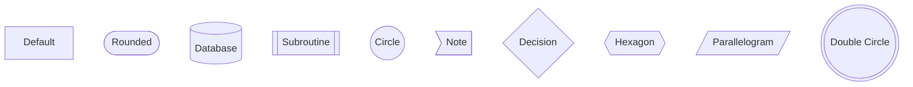
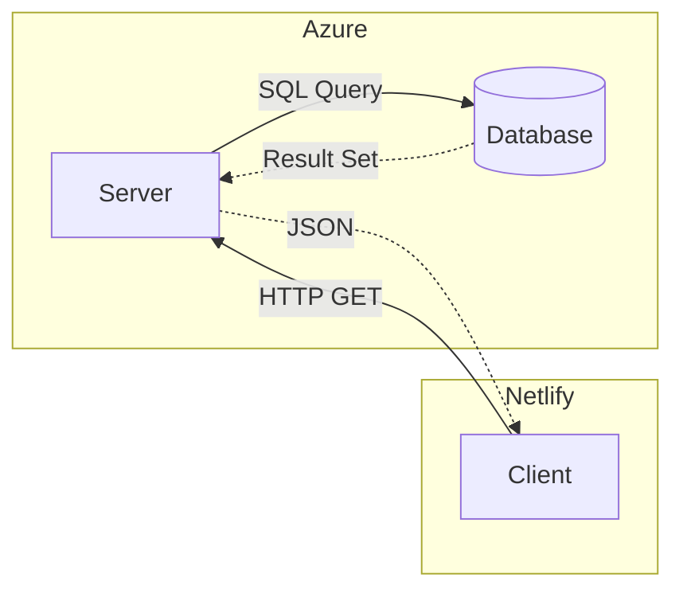
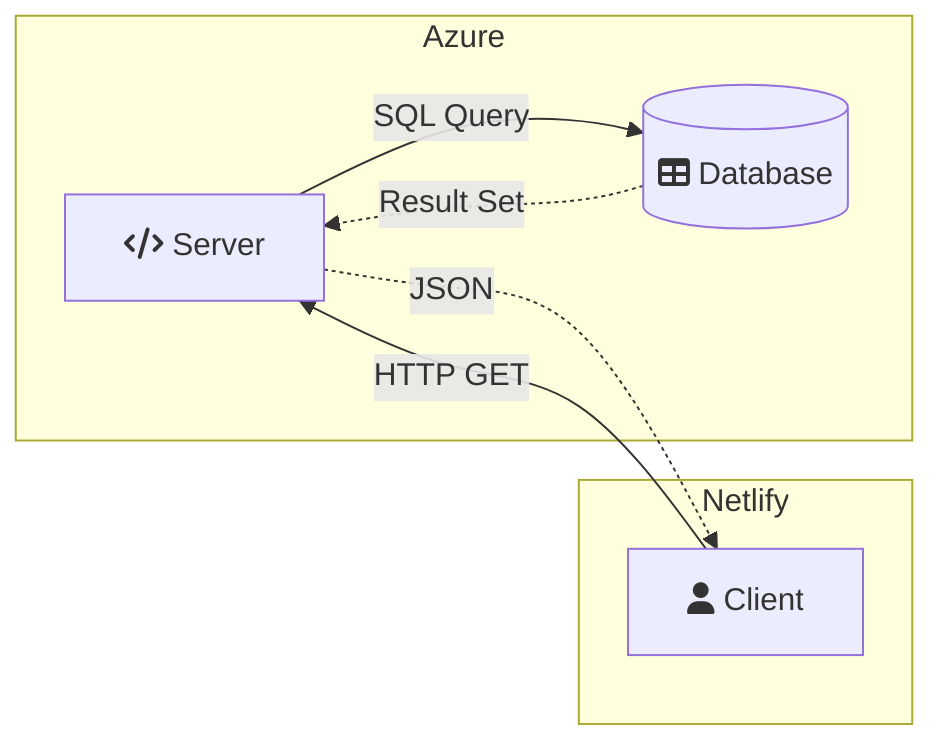

---
# Metadata
date: "2023-10-28"
author: "RH"
documentType: "howToUse"
linkedTo: "headquarters.md"
---

# Markdown How to Use Technical Documentation

## Introduction

- This document is a guide on how to format a selection of advanced markdown elements.
- Different aspects will have different sections within the `Instructions` section below.
- For preview purposes, the mermaid code is listed twice in the `Create Flowcharts` section.
- Also for the `Create Flowcharts` section, there's one line break between the code and the chart.
- There are two line breaks between two separate examples or parts within the section.
- More sections and contents will be added over time.

### What's Markdown?

- **Lightweight and user-friendly syntax**: designed for text styling.
- **Ideal for Diverse Documents**: well-suited for creating diverse documents including code documentation.
- **Easily Convertible to HTML**: can be effortlessly converted to structured HTML, making it suitable for web content creation.
- **Supports Metadata and Tagging**: grants the ability to add non-visible metadata in a `yaml` metadata section that doesn't show in preview mode.
- **Can be parsed at Scale with Python**: various Python libraries enable parsing of Markdown files which could be scaled depending on the setup.
- **Suitable for Machine Learning Documentation**: can be very effective for machine learning use cases given its structure and the ability to add metadata.
- **Interactive Documentation with `ChatGPT`**: allows for chatting with your directory through providing `chatGPT` with the proper parsing instructions.
- **Ease of Learning**: easy-to-learn syntax makes Markdown accessible, promoting its use especially in technical writing and software documentation spaces.
- **Cross-Platform Compatibility**: high portability and compatibility across different platforms and tools.
- **Available Alternatives**: `AsciiDoc`, `XML`, `reStructuredText`, `LaTeX`, `JSON`, CSV. Different solutions have different pros and cons on the machine X human compatibility balancing spectrum.

## Instructions

### Create Flowcharts

```"
flowchart
    Client
    Server
    Database
```

</br>



</br>
</br>

```"
flowchart
    Client --> Server
    Server --> Database
```

</br>



</br>
</br>

```"
flowchart LR
    Client --> Server
    Server --> Database
```

</br>



</br>
</br>

```"
flowchart LR
    Client --> Server
    Server --> Database
    Database -.-> Server
    Server -.-> Client
```

</br>



</br>
</br>

```"
flowchart LR
    c[Client]
    s[Server]
    db[Database]

    c -- HTTP GET --> s
    s -- SQL Query --> db
    db -. Result Set .-> s
    s -. JSON .-> c
```

</br>



</br>
</br>

```"
flowchart LR
    Base --> Arrow
    Base ==> Heavy
    Base -.-> Dotted
    Base --- Line
    Base --> You --> Can --> Chain --> Relations --> On --> One --- Line
```

</br>



</br>
</br>

```"
flowchart LR
    c[Client]
    s[Server]
    db[(Database)]

    c -- HTTP GET --> s
    s -- SQL Query --> db
    db -. Result Set .-> s
    s -. JSON .-> c
```

</br>



</br>
</br>

```"
flowchart
    a[Default]
    b([Rounded])
    c[(Database)]
    d[[Subroutine]]
    e((Circle))
    f>Note]
    g{Decision}
    h{{Hexagon}}
    i[/Parallelogram/]
    j(((Double Circle)))
```

</br>



</br>
</br>

```"
flowchart LR
    subgraph Azure
        s[Server]
        db[(Database)]
    end
    subgraph Netlify
        c[Client]
    end

    c -- HTTP GET --> s
    s -. JSON .-> c
    db -. Result Set .-> s
    s -- SQL Query --> db
```

</br>



</br>
</br>

```"
flowchart LR
    subgraph Azure
        s[fa:fa-code Server]
        db[(fa:fa-table Database)]
    end
    subgraph Netlify
        c[fa:fa-user Client]
    end

    subgraph Netlify
    end
    subgraph Azure
        direction LR
    end

    c -- HTTP GET --> s
    s -- SQL Query --> db
    db -. Result Set .-> s
    s -. JSON .-> c
```

</br>



### Add Links

```"
[Link_Name](Link goes here)
```

Example:
[Google.com](https://www.google.com)

## Sources

- [dev.to](https://dev.to/integerman/how-to-make-flowcharts-with-mermaidjs-1ooo)
-

### Add Image

```"

```
